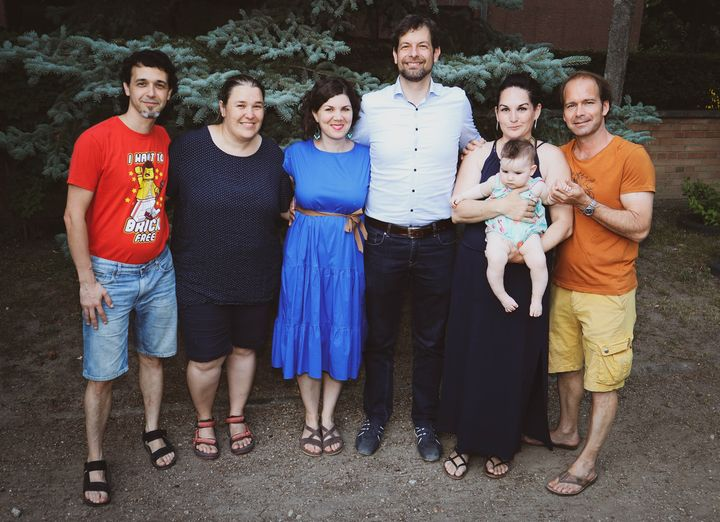

# Cvekedlia Küldetés - Gyereknapi mesés kódfejtő séta, 2021

Cvekedlia küldetés ALKOTÓ csapat, avagy a Gyereknapi mesés kódfejtő séta létrehozói.

A [Káposztási Családok Egyesülete](https://kaposztasicsaladok.hu/) és a [Majorka Színház](http://www.majorkaszinhaz.hu/) és Faragó & László család bemutatja a CVEKEDLIA küldetést!

A Cvekedlia küldetés lejátszási listáját itt találjátok.

<iframe width="560" height="315" src="https://www.youtube.com/embed/videoseries?si=Fw2xp7XBpNiO46wN&amp;list=PLcEmaOarSBsYrNyEQLncwW7n3L7px0dap" title="YouTube video player" frameborder="0" allow="accelerometer; autoplay; clipboard-write; encrypted-media; gyroscope; picture-in-picture; web-share" referrerpolicy="strict-origin-when-cross-origin" allowfullscreen></iframe>

* Jobbról:
A főszerepben: Táncsits Maja és András Tapolcsányi és Bodza

* Balról:
Webes megjelenés és grafika: Noémi László
Mese, forgatóköny, videó szerkesztés, animálás: Attila Farago
[Cvekedlia küldetés forgatókönyv](assets/cvekedlia_forgatokonyv.pdf)

* Középen:
Ötlet, szervezés, operatőr, arculat, kommunikáció: Smohayné Simon Gyöngyvér
Útvonal, tanácsadás: Ferenc Smohay

* Külön köszönet:
Játék grafika: Luca Panna Faragó
Hangmérnök és sárkány FSX: Faragó Tomi

* További köszönet a sok jó ötletért: Mici, Palkó, Klári, Kamilla, Lelle, Boró, Hanga, Villő

