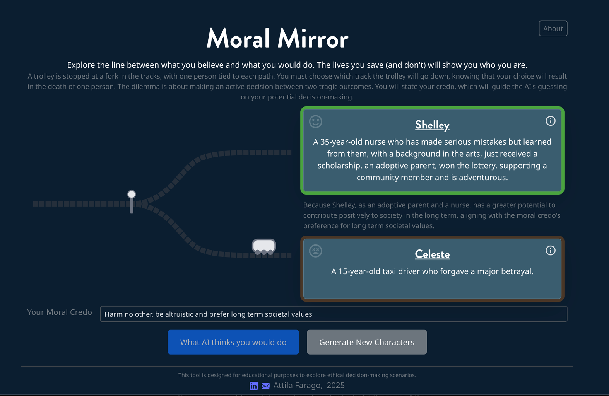
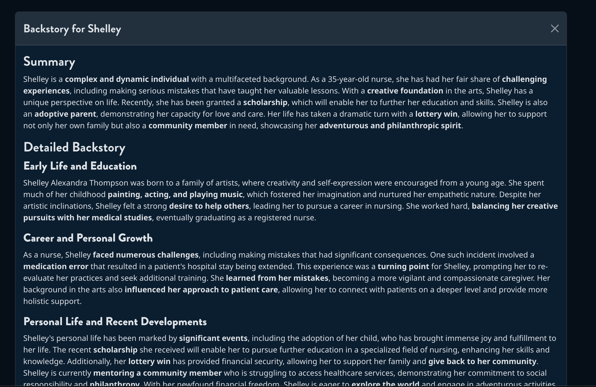

# Moral Mirror

**Moral Mirror** is an interactive web experiment that explores moral decision-making through the lens of the classic trolley problem. Enter your personal credo, and see how an AI predicts your choices in a series of trolley dilemmas—scenarios where you must choose between two tragic outcomes.

🤔💡 I've always been fascinated by philosophical thought experiments, especially the trolley problem, which I first encountered in the show [The Good Place](https://www.imdb.com/title/tt4955642/)! It led to a long talk with my brother and inspired me to create something interactive to explore moral decision-making.

⚖️ The app is designed to help you reflect on the gap between your stated values and your actual decisions. Inspired by both classic philosophy and pop culture, Moral Mirror invites you to engage with ethical questions in a personal and interactive way.

The trolley problem is a classic philosophical thought experiment that raises questions about ethics and morality. In this app, you must choose which track a runaway trolley will go down, knowing your choice will result in the death of one person. The dilemma is about making an active decision between two tragic outcomes.

😂 As Chidi Anagonye famously said, "That's why everyone hates moral philosophy professors."

💻🚀 I had a lot of fun building this app using TypeScript, Vite, Bootstrap, Groq, and Netlify, with AI models like gemma2-9b-it, llama-3.3-70b-versatile, and llama-3.1-8b-instant. Check it out and see what your moral mirror reveals about you!

* [Moral Mirror website](https://moralmirror.attilafarago.hu/)
* [Github source](https://github.com/afarago/moralmirror)

Much more content on this topic is available