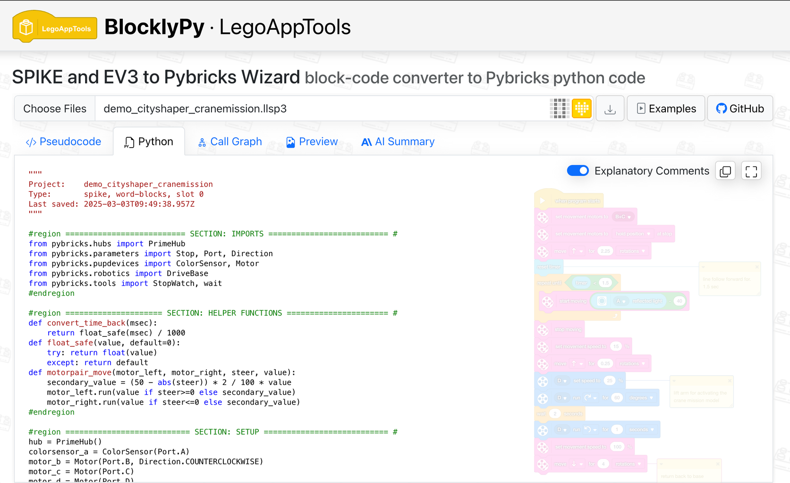
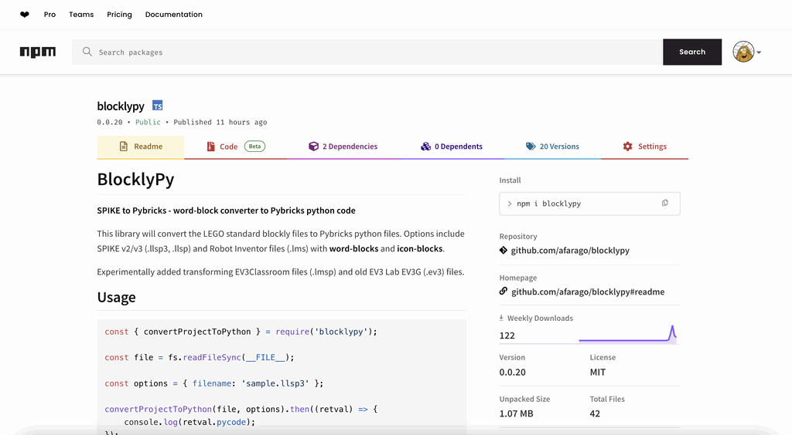
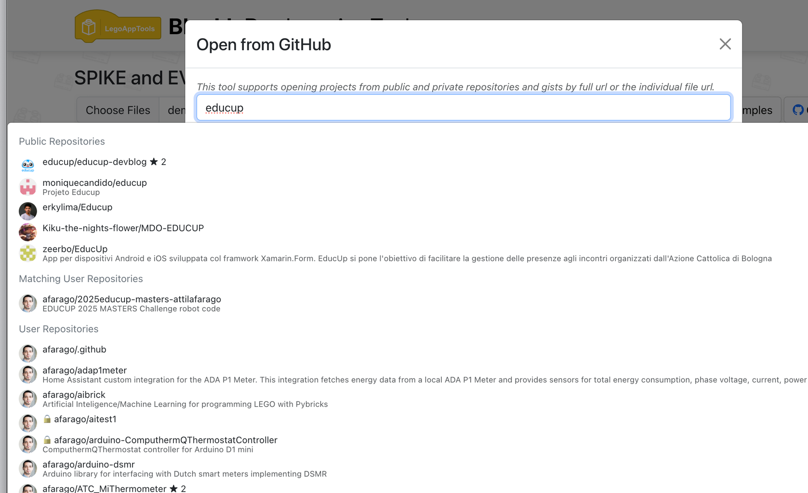
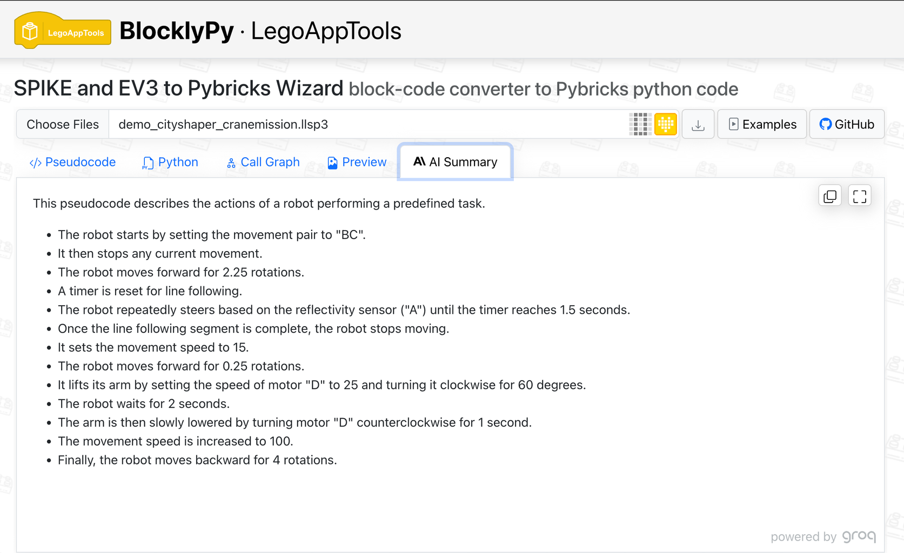
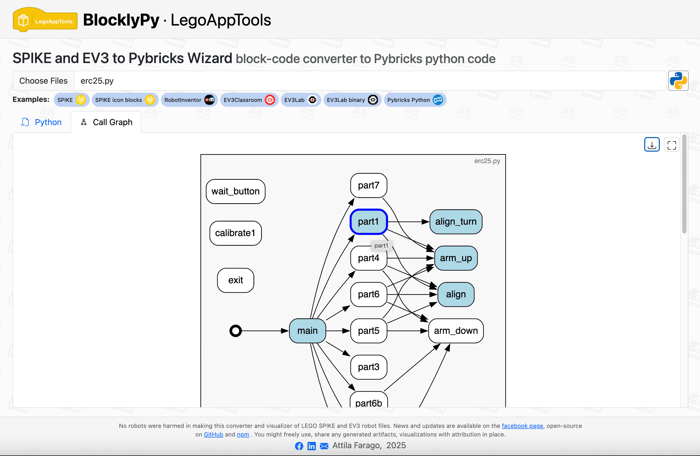
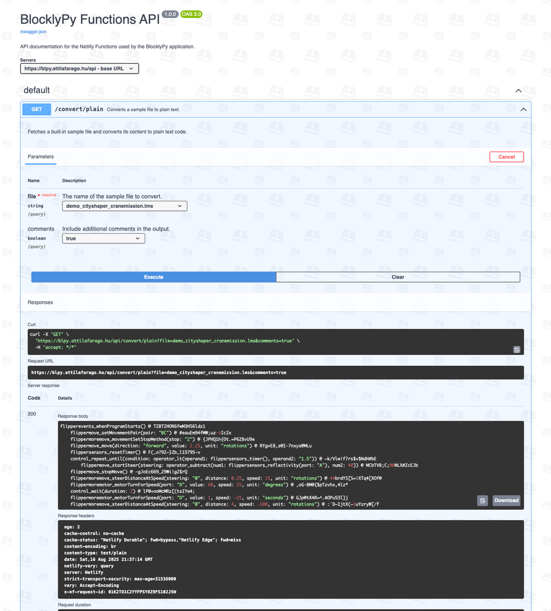

# LEGO App Tools and BlocklyPy package

{: .project-logo }

## BlocklyPy tool and package

[BlocklyPy](https://blpy.attilafarago.hu/) SPIKE and EV3 to Pybricks Wizard block-based code to Pybricks python code converter - covering SPIKE, Robot Inventor and even EV3 both EV3Classroom and EV3Lab.

Functions:

- List and analyze a SPIKE word-block, icon-block or EV3Classroom, EV3Lab .ev3g, .compiled binary .rbf and wedo2 programs in a text based language
- Convert to [pybricks](https://pybricks.com) compatible Python code
- Use variables and data wires properly
- Generate dependency call graph
- Summarize the code in a natural language format via AI
- Fully supported [REST API](https://blpy.attilafarago.hu/api)
- Copy & paste the code

Also available as a standalone [npm package and cli tool](https://www.npmjs.com/package/blocklypy).

## LEGO App Tools

[LEGO App Tools](https://legoapptools.azurewebsites.net/) Various tools to help your life with LEGO SPIKE and modern Mindstorms apps.

Functions:

- List a SPIKE WordBlock/IconBlock program in a textual basic like language
- Fix a few crashing errors online
- Show SPIKE Machine learning pictures
- Show and download "Preview" for documentation

