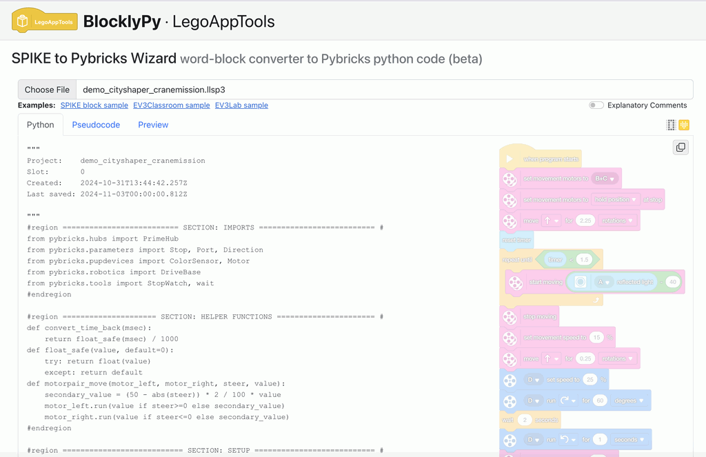
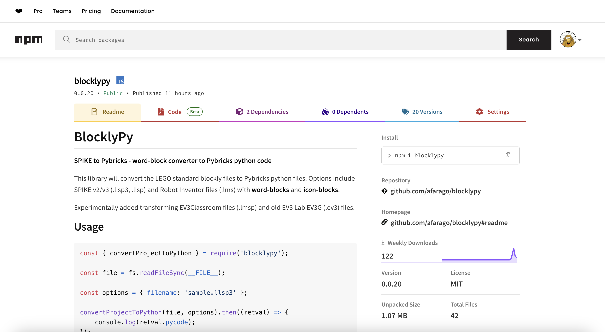

# LEGO App Tools and BlocklyPy package

{: .project-logo }

## BlocklyPy tool and package

[BlocklyPy](https://blpy.attilafarago.hu/) SPIKE to Pybricks Wizard word-block converter to Pybricks python code - covering SPIKE, Robot Inventor and even EV3 both EV3Classroom and EV3Lab.

Functions:

- List a SPIKE WordBlock/IconBlock or EV3Classroom/EV3Lab-EV3G program in a textual basic like language
- Convert to [pybricks](https://pybricks.com) compatible Python code
- Use variables and data wires properly
- Copy & paste the code

Also available as a standalong [npm package](https://www.npmjs.com/package/blocklypy).

## LEGO App Tools

[LEGO App Tools](https://legoapptools.azurewebsites.net/) Various tools to help your life with LEGO SPIKE and modern Mindstorms apps.

Functions:

- List a SPIKE WordBlock/IconBlock program in a textual basic like language
- Fix a few crashing errors online
- Show SPIKE Machine learning pictures
- Show and download "Preview" for documentation

