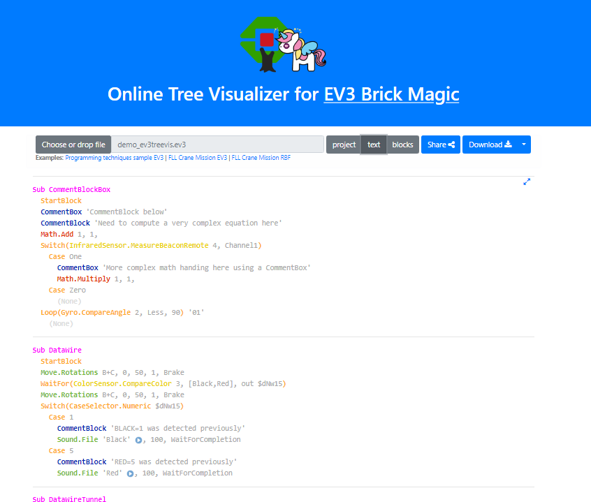

# EV3 Brick Magic and Tree Visualizer

{: .project-logo }

[EV3 Brick Magic and Tree Visualizer](http://ev3treevis.azurewebsites.net/) and [Tree Visualizer](https://afarago.github.io/EV3TreeVisualizerPages) can visualize EV3 programs created by the LEGO Mindstorms EV3 programming environment EV3-G and EV3M programs created on the iPad graphical programming.

Functions:

* List an EV3 program in a textual basic like language
* Show a call connection graph between programs
* Decode/decompile program from EV3 Brick
* Share your code through cloud
* Command line direct connection to EV3 Brick in Windows

