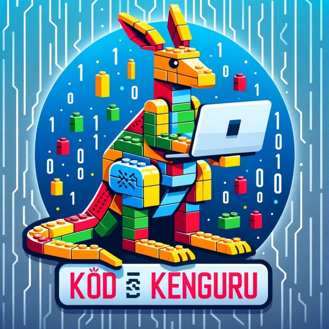

# Kód és Kenguru podcast by Attila, Kornél és Balázs

{: .project-logo }

A podcast about robotics technology, best practices, teams and events in Hungary

Robotika, építés, játék, tanulás... Ezekről beszélgetünk, segítünk elindulni, fejlődni. Interjúk, beszélgetések, versenybeszámolók, eseményajánlók...

[Listen to Kód és Kenguru podcast](https://open.spotify.com/show/3oRR0SbFVHtnxSdsVG6blx)

## 2023-2024

* Kód és Kenguru #14 - RoboSport
* Kód és Kenguru #13 - WRO extra kihívás
* Kód és Kenguru #12 - versenyfelkészülés körkép
* Kód és Kenguru #11 - Future Innovators
* Kód és Kenguru #10 - Future Engineers
* Kód és Kenguru #8 - Storms
* Kód és Kenguru #7 - Hogyan kezdjem?
* Kód és Kenguru #6 - BETT és FLL
* Kód és Kenguru #5 - Arduino és robotika
* Kód és Kenguru #4 - Hogyan legyél coach?
* Kód és Kenguru #3 - ERC értékelő
* Kód és Kenguru #2 - Edu Robotics Cup
* Kód és Kenguru #1 - WRO Panama

