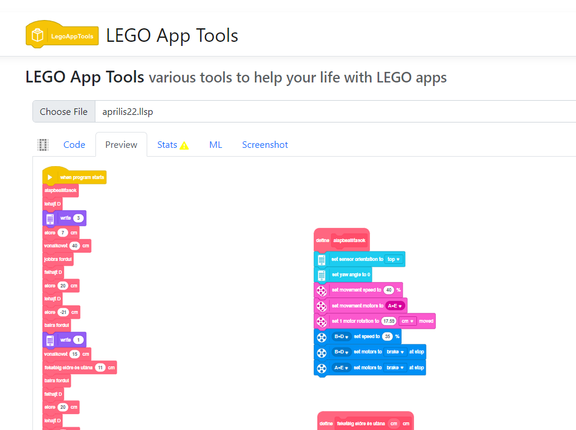

# LEGO App Tools

{: .project-logo }

[LEGO App Tools](https://legoapptools.azurewebsites.net/) Various tools to help your life with LEGO SPIKE and modern Mindstorms apps.

Functions:

* List a SPIKE WordBlock/IconBlock program in a textual basic like language
* Fix a few crashing errors online
* Show SPIKE Machine learning pictures
* Show and download "Preview" for documentation

