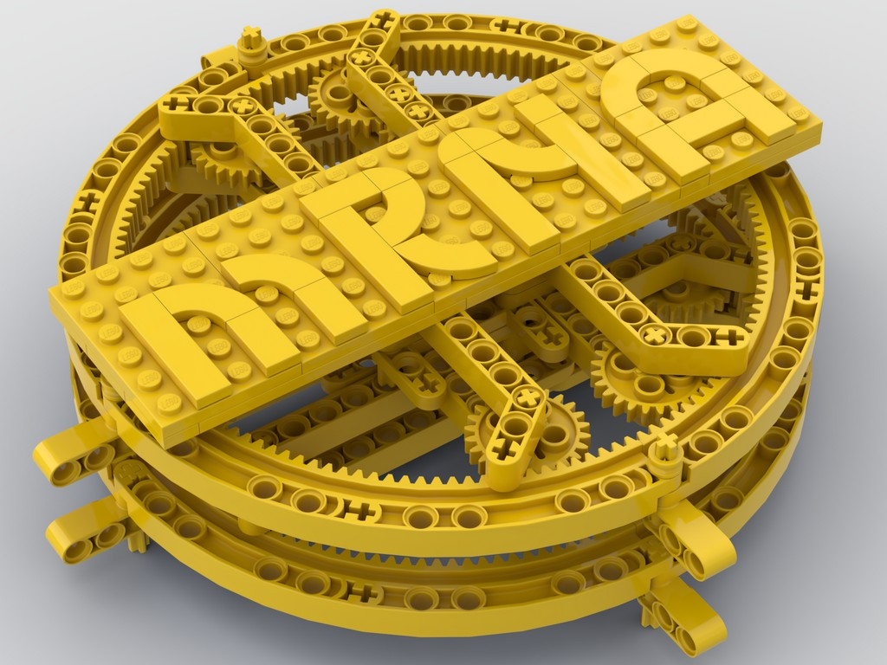

# mRNA - WLWYB Rock the Mock LEGO contest

*Hacking Pandemic through Bananahelix 162 mRNA-DNA*

<iframe width="560" height="315" src="https://www.youtube.com/embed/jvAmQFpo2eQ" title="YouTube video player" frameborder="0" allow="accelerometer; autoplay; clipboard-write; encrypted-media; gyroscope; picture-in-picture; web-share" referrerpolicy="strict-origin-when-cross-origin" allowfullscreen></iframe>

# Motivaton

The clear challenge spanning over 2019-2020-2021 - three separate years now - is the global pandemic that affects the life of billions over the planet. The enormous brainpower of the most brilliant minds goes into solving, tricking even hacking this epic chapter of modern history.

Hacking the code behind the helix of RNA was attempted in several different ways, and as of today, one successful method seems to be connected with teaching our bodies' DNA double helix through specifically designed messenger RNA / mRNA. This method helps the body to "learn" antibody development without exposing it to weakened, yet real virus RNA. One remarkable face of this technology is adj assoc professor Katalin Karikó University of Pennsylvania, senior vice president at BioNTech.

Her work and efforts are much appreciated and this submission is to highlight her diligent work and success.

# Model description

The WLWYB challenge invites us for the use of yellow LEGO color.

This color constraint made it obvious that an old-time favorite, the banana beam will be used for this project. The mechanism is designed in a way that as you hold the core in your hand and slowly turn the bottom ring the top ring turns to mimic the double helix learning the mRNA code. However, as research and learning can progress only with diligent and precise work that assumes not only funding but enormous amounts of time and includes several ups and downs - the top dial speed is reversed and reduced by gearing to 66% (24->24->12 / 8->8->8->24).

The axle-pin connectors resemble the spike protein piece in mRNA to be replicated in the DNA.

One additional challenge using technic was to avoid the usage of pins - due to the color constraint - and stabilize the model by axle connections. The two rings hold the structure by a mutual interlocking mechanism that provides the necessary structural integrity.

Fun fact: Pfizer-BioNTech has named their COVID-19 vaccine BNT162b2, therefore the model has 162 pieces.

