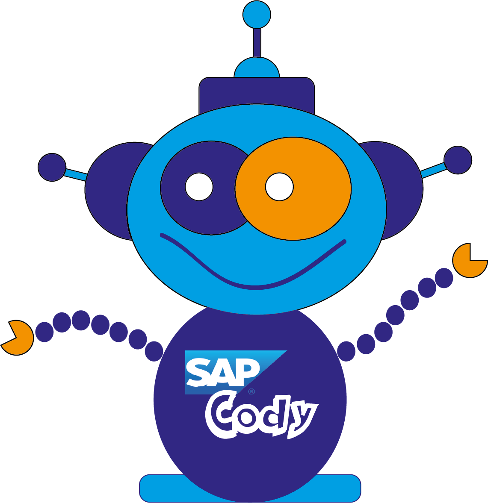

# SAP CodingKids Program 2014-2016

{: .project-logo }

*Kódolni a következő2 generáció is megtanulhat*

Bővebb információk az [SAP közösségi oldalán](https://community.sap.com/t5/tag/codingkids/tg-p/board-id/additional-blog-sap).

## Letölthető óravázlatok

1. [Szerkesztői felület](assets/codingkids/codingkids_oravazlat_01_szerkesztoi_felulet.pdf)
2. [Megmozdulnak a szereplők](assets/codingkids/codingkids_oravazlat_02_megmozdulnak_a_szereplok.pdf)
3. [Újra és újra - ismétlődések](assets/codingkids/codingkids_oravazlat_03_ujra_es_ujra_ismetlodesek.pdf)
4. [Mire jó a jelmez és az animáció?](assets/codingkids/codingkids_oravazlat_04_mire_jo_a_jelmez_animacio.pdf)
5. [Nem mindig viselkedünk ugyanúgy – Feltételek](assets/codingkids/codingkids_oravazlat_05_nem_mindig_ugyanugy_viselkedunk.pdf)

## Kik vagyunk, és mivel foglalkozunk?

A németországi, walldorfi székhelyű SAP-nak több 130 országban van irodája. A vállalat az üzleti szoftverek és szoftverekhez kapcsolódó szolgáltatások legnagyobb, világszintű vezetője. Magyarországon közel 700 kolléga dolgozik az SAP Hungary Kft.-n belül a III. kerületi Graphisoft Parkban.

Mivel társadalmi felelősségvállalásunk kiemelt részének tartjuk, hogy a programozást és az analitikus gondolkodást közelebb hozzuk a fiatalabb korosztályhoz, gyermekeknek (a fő korosztály 9-15 éves kor közötti fiúk és lányok) szeretnénk kódolási, illetve informatikai alapismereteket nyújtani, a korosztályuknak megfelelő játékos módon a Scratch program segítségével. Mivel az általános iskolák és középiskolák túlnyomó többségénél ez a fajta oktatás teljesen háttérben marad, hiánypótló lehet a projekt. A program természetesen teljesen ingyenes, és nem jár semmiféle kötelezettséggel.

## De mi is a Scratch, amit szeretnénk bemutatni a diákoknak?

A világszerte egyre népszerűbb Scratch valójában egy programozási környezet, melyet a kódolással ismerkedő gyermekek számára fejlesztett ki a Lifeling Kindergarten csoport a MIT Media Lab keretein belül. A programmal játékokat és meséket lehet készíteni, a programozás alapjainak elsajátításával. A Scratch ingyenesen letölthető, tehát bárki számára elérhető akár a tanórán kívüli gyakorlásra is, továbbá magyar nyelven is használható. Az óráról és a programról több információt a linkek között találhat.

## Eddigi eredményeink

Jelenleg egy 2014 őszi és egy 2015 tavaszi fordulón vagyunk túl. Az SAP CodingKids első évadában tavalyi év szeptemberében és októberében összesen 13 előadást tartottunk 7 iskolában, mellyel 350 diákot értünk el. Az évad zárásaként egy kódolási-kreatív pályázatot is hirdettünk, melyre nagyon szép pályamunkákat kaptunk. Emellett az itt dolgozó kollégák 5-16 éves gyermekeinek is tartottunk egy egész délutános Kód-Játszóházat két korcsoportban

A folytatásban, a CodingKids második évadában 2015 májusában immár több önkéntes és lelkes kollégát bevonva 24 tanórát tartottunk 12 iskolában és 533 gyerekhez jutottunk el 16 kolléga segítségével az idei év májusában. Ezt a tanévet is díjátadóval zártuk le. Néhány iskola, ahol jártunk már: többek között az Eötvös Gimnázium, a Madách Gimnázium, Újbuda Alma Mater, Budai Ciszterci Szent Imre Gimnázium, Patrona Hungariae.

## Terveink a következő tanévre

Folytatjuk a Scratch program bemutatását újabb iskoláknak és évfolyamoknak, de szeretnék egyúttal tovább is lépni, és kidolgozott óratervekkel, fogadó órákkal és workshopokkal segíteni azon pedagógusok munkáját, akik valamilyen formában be akarják építeni a játékos kódolást – akár egy-egy óra vagy szakkör erejéig - a tantervbe, és ezzel egy rendkívül hasznos és korszerű tudáshoz juttatni az érdeklődő diákokat. Terveink szerint a tanév során a pályázatokban és a konzultációs workshopokon legaktívabb iskolát különdíjban is részesítjük.

## Gyakorlati információk

* A bemutató óra 45 perces, beleférhet egy rendhagyó informatika órába esetleg, de az órák számát és időpontját mindig egyeztetjük az intézménnyel
* minimális létszám egy osztály, azaz körülbelül 20 fő
* termen kívül projektor az egyetlen szükséges eszköz
* a korosztály 9-15 év között, tehát 3-4. osztálynál már nagyon jól működik a program

## Hasznos linkek

* [CodingKids bevezetés](http://prezi.com/sdhyli47xbnc/scratch-nyilt-ora/)
* [Scratch program](http://scratch.mit.edu)
* Kapcsolat - Pásztor Bianka, Faragó Attila
* SAP University Alliances - Ádám Dudits

### További információ, hasznos linkek

* [SAP CodingKids pályázat, 2014](https://scratch.mit.edu/studios/675690)
* [SAP CodingKids pályázat, 2015](https://scratch.mit.edu/studios/1508184)
