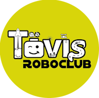

# Tövis Robotics Club

{: .project-logo }

TövisCsapat Robotics has started its first team in 2014 on the First Lego League FLL robot programming competition. The team has connected over fifty kids with STEAM and programming so far.

<iframe width="560" height="315" src="https://www.youtube.com/embed/32ZWr7MR5Jc" title="YouTube video player" frameborder="0" allow="accelerometer; autoplay; clipboard-write; encrypted-media; gyroscope; picture-in-picture; web-share" referrerpolicy="strict-origin-when-cross-origin" allowfullscreen></iframe>

🌍[http://toviscsapat.hu](http://toviscsapat.hu/) \
🔗[https://www.facebook.com/toviscsapat](https://www.facebook.com/toviscsapat) \
🤖LEGO Mindstorms, Team Building \
🏆World Festival Detroit Champion Finalist team \
👌FIRST LEGO League Challenge, FIRST LEGO League Junior/Explore, World Robot Olympiad