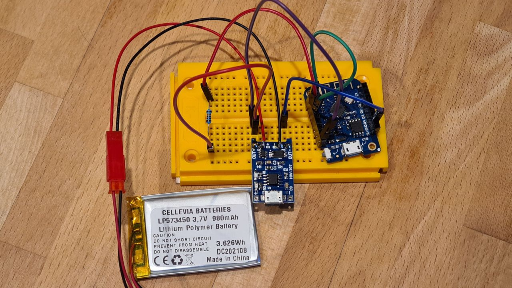
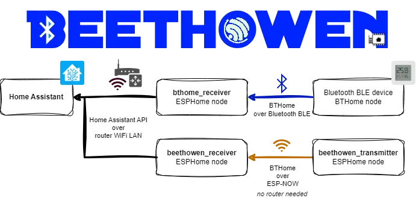
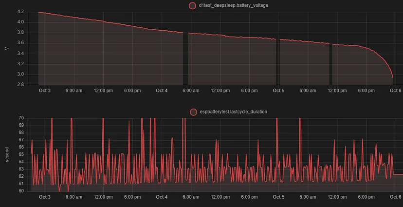
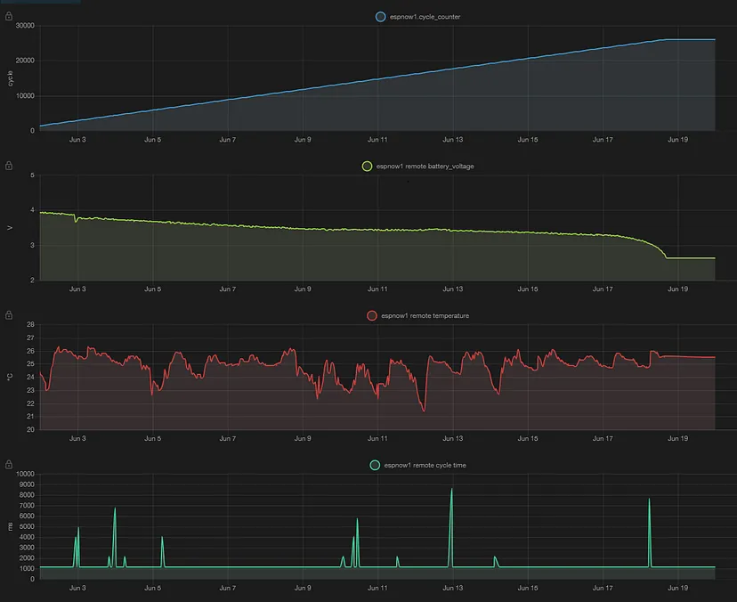

# Battery testing and Low-Energy Smart Devices

Experiments to create low-energy smarthome sensor solutions

Iterations:

1. **Wifi to HomeAssistant - V1**\
   Using Wemos D1 Mini V1 still draws a 2-3mA high deep_sleep current.
2. **Wifi to HomeAssistant - V3**\
   Improved deep_sleep current - 200uA. This resulted in a 980mAh to be able to push a measurement every 60 seconds 4,237 times before the battery was depleted, resulting in a 3.1 days total runtime.
3. **BTHome over ESPNow**\
   As a second experiment I was using ESP-NOW channel, reducing complete active time to 1,150 milliseconds resulting and increase 26,106 cycles of a 17.5 days total runtime with the same 980mAh battery of 60 second cycle time.\
   With additional improvements could reduce it to ~250ms ac tive connection time with over 40,000 cycles.

Key details:

* Hardware: Wemos D1 Mini V3, Espressif 8266
* Programming: BTHome and Beethowen Components [custom component](https://github.com/afarago/esphome_component_bthome).
* [Implementing Low-Energy Smart Devices with Several Years of Independence](https://medium.com/@attila.farago.hu/implementing-low-energy-smart-devices-with-several-years-of-independence-970077900cf4)

