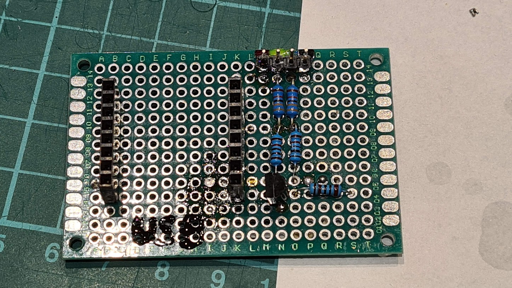
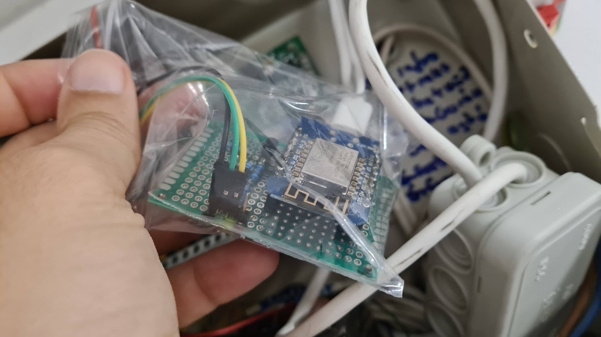
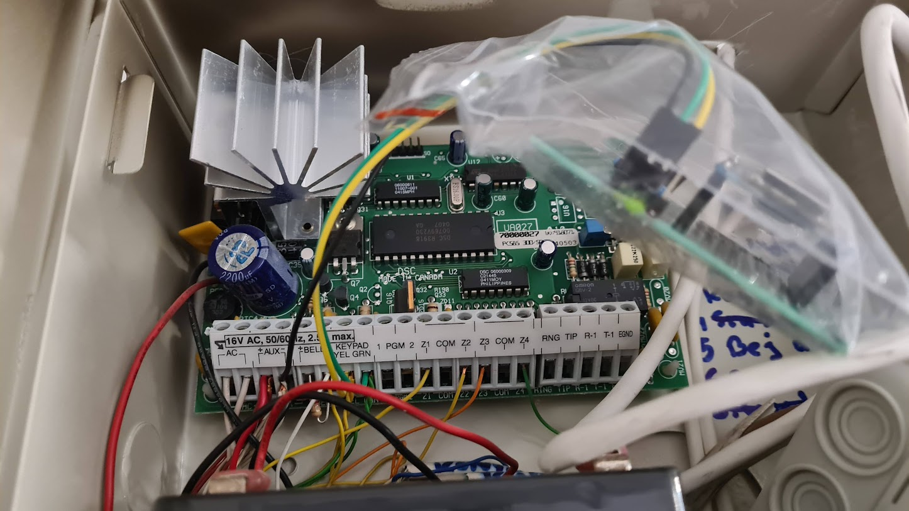
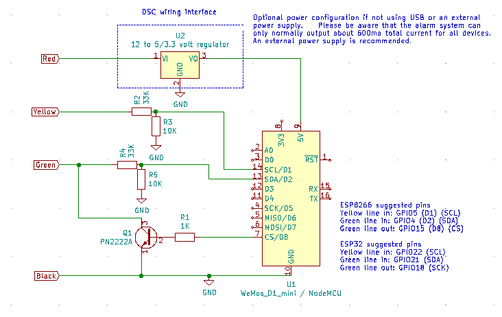

# ESP DSC Alarm · Smarthome interface

* Host: [DSC PC585](https://cms.dsc.com/download2.php?t=1&id=12934) alarm system
* Hardware: Wemos D1 Mini ESP8266
* Wiring: [esphome-dsckeybus by Dilbert66](https://github.com/Dilbert66/esphome-dsckeybus)
* Programming: ESPHome over custom component via include [esphome-dsckeybus](https://github.com/Dilbert66/esphome-dsckeybus)
* Note: Custom 3D printed project box -- pictures show test state.
* Note: Hate the hacky wiring in the alarm box, yet lacking the knowledge I will leave it as is for now.

