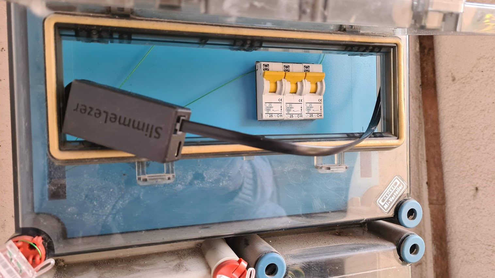
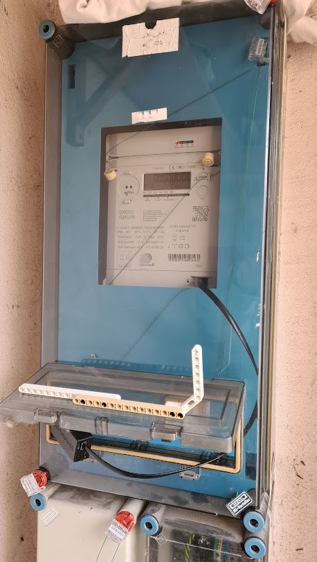
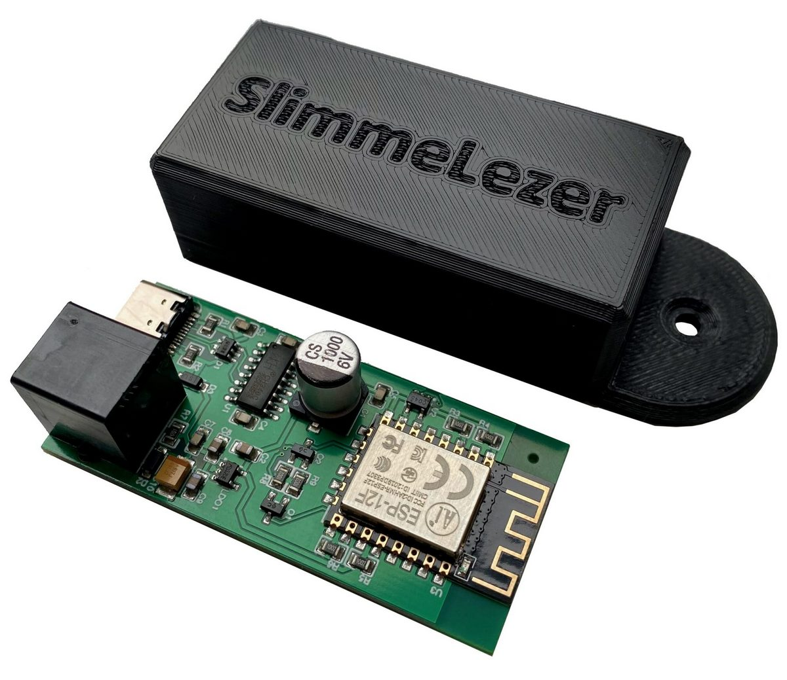

# Energy meter · Smarthome interface

* Interface smart energy meter via P1-port over DSMR protocol
* Host: [SX631 Saxing](https://mvmemaszhalozat.hu/elmu/file/downloadfile?id=4b24bda1-d8de-414e-b4db-76f9d824dd05) power meter
* Hardware: [SlimmeLezer+](https://www.zuidwijk.com/product/slimmelezer-plus/) by Marcel Zuidwijk - ESP12-F, ESP8285 MCU
* Programming: DSMR · ESPHome Component [dsmr](https://github.com/afarago/dsmr) adaptation for Hungarian electricity meters.
* Fun fact: the meter box has been installed in a funny way not exily to expose the user P1 port.\
  Nevertheless LEGO is my best ally to solve such issues.

