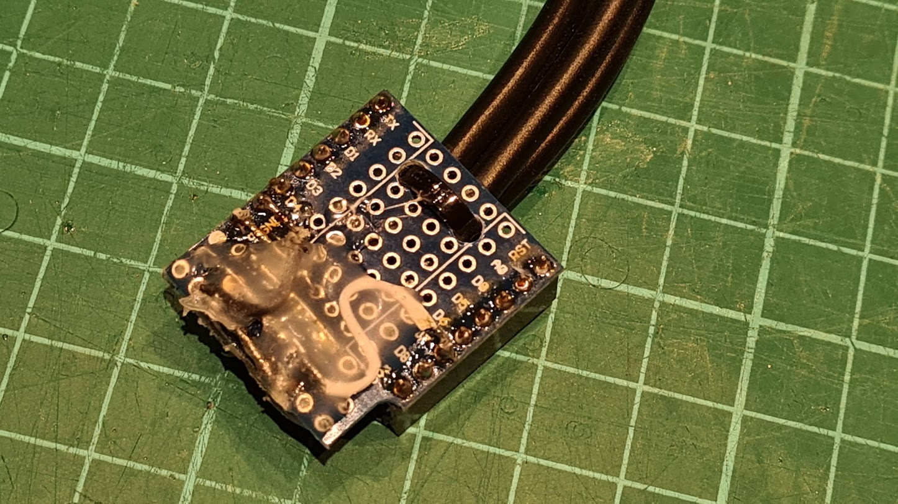

# ESP Heating control · Smarthome interface

* Control heating through a pre-installed radio remote and monitor heating water temperature. \
  This external component provides a way retrieve and control Computherm Q series thermostats. The RF receiver allows up to four individual devices. Existing devices can either be monitored as sensors or via manual pairing (in progress) you can add virtual zones that control the boiler separately.
* Host: [Computherm Q8RF](https://computherm.info/en/digital_thermostats/computherm_q8rf) multi-zone, wireless (radio-frequency) programmable digital room thermostat
* Hardware: Wemos D1 mini ESP8266 MCU, HopeRF RFM217W-868S1, HopeRF RFM117W-868S1
* Hardware: Dallas DS18B20 sensors in normal mode
* Programming: Computherm Q8RF 868.35 MHz - ESPHome [custom component](https://github.com/afarago/esphome_component_computhermqrf).
* Note: Combined RF receiver and transmitter to a single shield - fixing and isolating with a hot glue.

