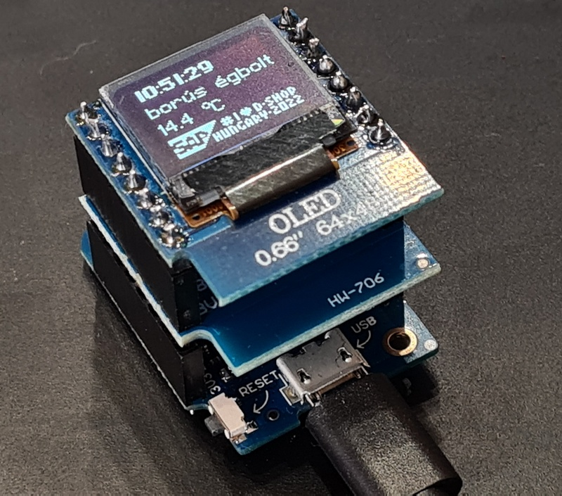
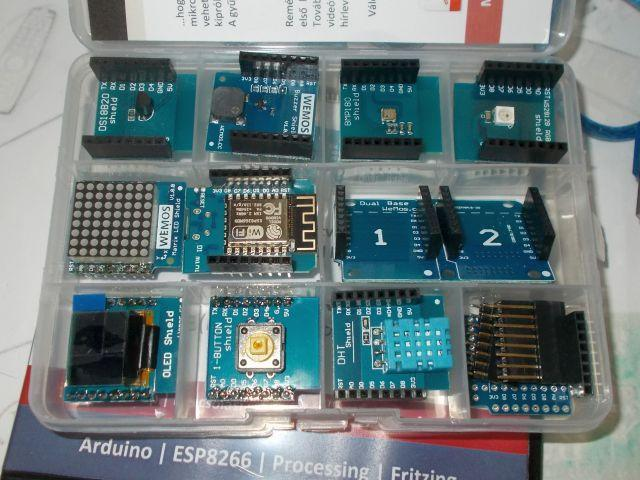

# Home Automation workshop using ESP8266 Wemos D1 toolkit and shields using ESPHome

Step-by-step project instructions and tutorial for SAP Labs Hungary d-shop 2022 session.

* Hardware: Wemos D1 Mini kit ([MiniWifi IoT- Zero](https://shop.tavir.hu/termek/shop/oktato_tanulo_keszlet/esp8266_esp32_nodemcu/miniwifi-iot-zero-keszlet/))
* Step-by-step [project instructions](https://www.reddit.com/r/shellycloud/comments/qh66p9/3d_printing_finished_notification_my_home/), tutorial and [preparation](https://github.com/afarago/esphome-slh-dshop22/raw/main/Home%20Automation%20Workshop%2010%20min%20Preparation.docx) for SAP Labs Hungary d-shop 2022 session.

