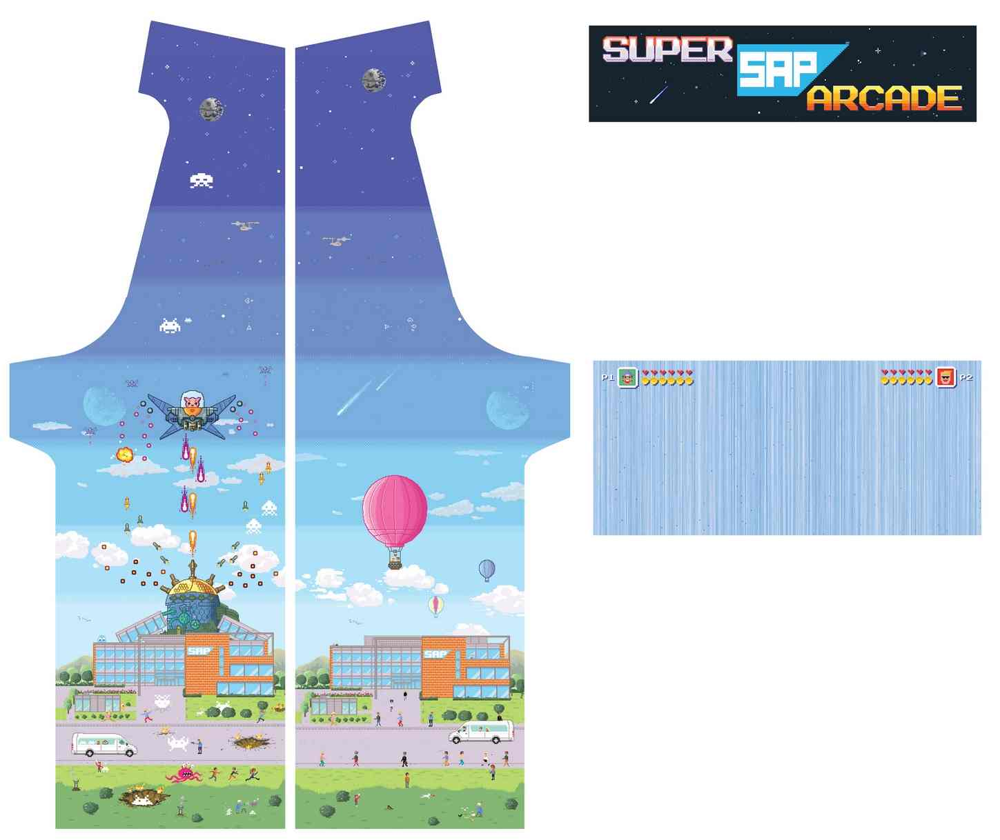
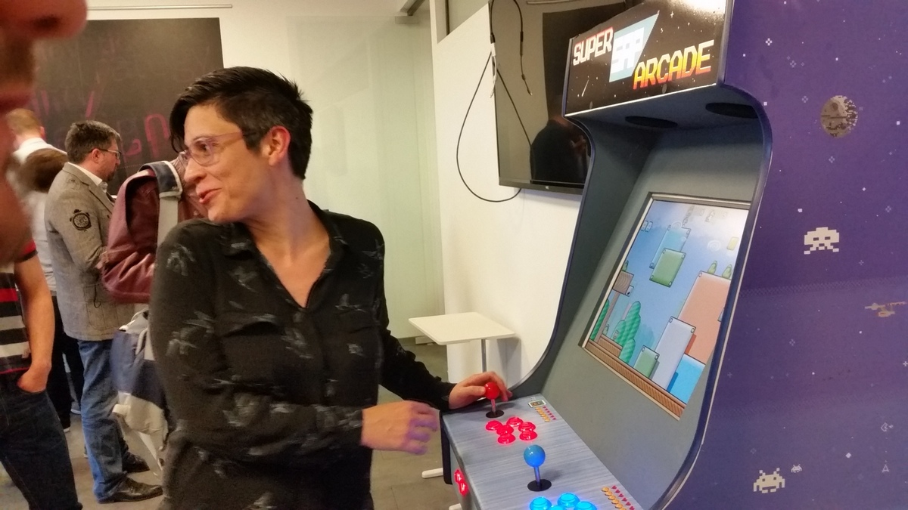

# SAP ArcadePi

Four colleges joined forces to create a DIY arcade machine for the colleagues.

Key components:

* plywood and painted frame
* special pixel art design decal
* Raspberry Pi using retropi image
* push buttons and joystick from online store
* and an old LED monitor

