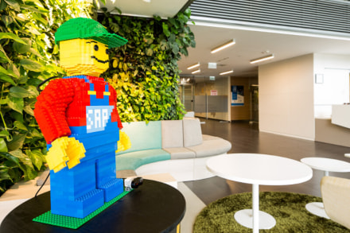

# SAP LEGO Figure

{: .project-logo }

I have re-modelled a famous LEGO minifig design to have SAP pixelated on the front, ordered all bricks and created a step-by-step instruction for 5 body parts, added the EV3 mindstorms kit to motorize it.

Next organized an afternoon workshop within SAP Labs Hungary to assemble the body parts, then the figure itself.

It was fun for everyone!

[LEGO building instructions LXF.](assets/sap_minifig4a.lxf)