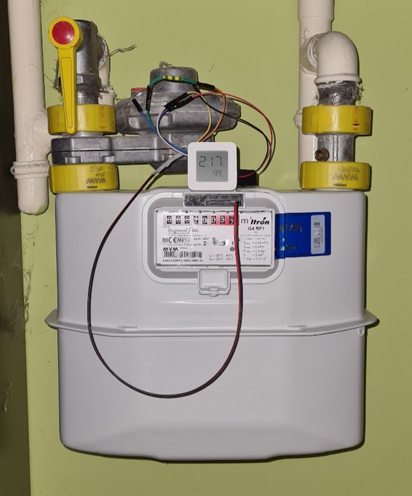
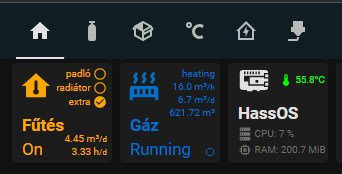

# Smart Gasmeter · Smarthome interface

Key details:

* Use and improve a cheap xiaomi temperature sensor for measuring gas consumption.
* Host: Flogiston RF1 G4 meter - reed signal every 0.01 m3
* Sensor: NO (normally open) reed switch
* Note: The wiring was for test purposes - now it is added to a custom project box.
* Note: Reed switch still introduces bouncing effect, especially when in a closed state -- need to debounce it.

Initial iterations:

1. ESP MCU -- failed as I have no stable 220AC or 5DC near the meter.
  * ESP32Cam [AI-on-the-edge](https://www.youtube.com/watch?v=iUgxwbfkIqU)
  * ESP8266 Wifi MCU with reed switch
  * ESP32 [ULP reed-switch](https://lastminuteengineers.com/esp32-sleep-modes-power-consumption/) with periodic Wifi push.
2. Xiaomi LYWSD03MMC temperature meter with custom firmware
  * [custom firmware](https://github.com/pvvx/ATC_MiThermometer) by pvvx
  * discussions and idea leading Victor kindly adding reed counter, then having general DIY format extended to [BTHome](https://attilafarago.hu/bthome.io) protocol.

